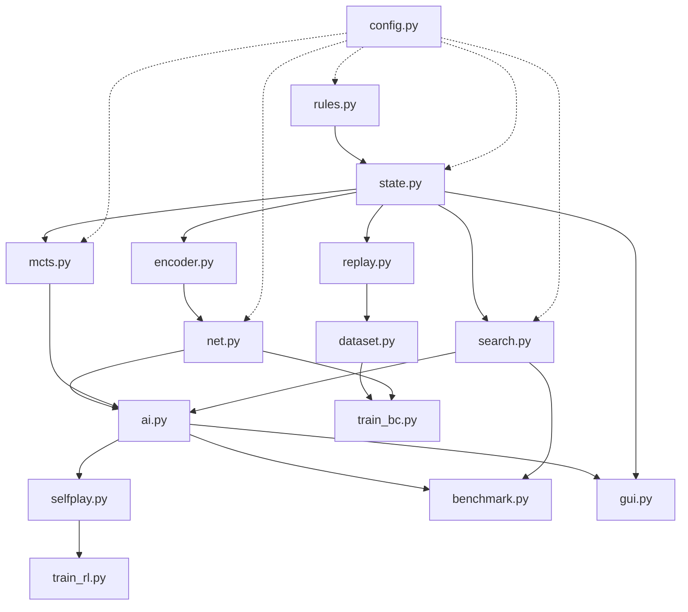

# 军棋翻棋引擎项目结构重构报告

> **创建日期**: 2026-09-05  
> **适用版本**: junqi_engine v1.x  
> **项目类型**: Python 强化学习游戏 AI 引擎  
> **重构目标**: 全面梳理现有结构，为代码组织优化提供决策依据

---

## 📋 执行摘要

本项目是一个基于 **PyTorch + AlphaZero/MCTS** 的军棋翻棋 AI 推演引擎，核心功能包括：
- 规则建模与状态管理
- 蒙特卡洛树搜索 (MCTS)
- 深度强化学习自对弈训练
- 不完全信息博弈处理
- 人机对战 GUI 界面
- 复盘数据回放与分析

当前存在的主要**架构问题**：
1. **历史遗留目录冗余**：`models/`, `models_v3/`, `models/test*` 等多个模型存储目录混杂
2. **验证脚本散落在根目录**：`_verify*.py` 文件未归类，难以维护
3. **测试与生产代码混合**：`tests/` 目录外存在大量独立 benchmark 脚本
4. **配置分散**：规则参数在 `config.py`，但 APK 对齐说明分散在多文档
5. **训练产物无统一版本管理**：`.pt` 权重文件与 JSONL 日志混存

---

## 🏗️ 完整目录结构分析

### 1. 根目录层级（Level 1）

```
junqi_engine/
├── *.md                      # 项目文档与管理规范 (7 个)
├── _verify_*.py              # 临时验证脚本 (4 个) ⚠️
├── gen_*.py                  # 资源生成脚本 (2 个)
├── benchmark_*.py            # 基准测试脚本 (2 个) ⚠️
├── assets_app/               # 棋子贴图资源目录
│   └── cells/                # 单元格图像资源
├── datasets/                 # 行为克隆数据集
│   └── p1_v1/                # 第一版数据
├── docs/                     # 技术文档与论文
│   ├── CHANGELOG.md          # 更新日志
│   ├── P4_EXECUTION_PLAN.md  # P4 阶段执行计划
│   ├── PROJECT_KNOWLEDGE_AND_THEORY.md
│   ├── TRAINING_ROOT_CAUSE_REVIEW.md
│   └── *.pdf                 # 学术论文参考
├── eval_sets/                # 评估集残局题库
├── games/                    # 游戏引擎接口层
├── junqi/                    # 核心业务模块 ⭐
│   ├── __init__.py
│   ├── __main__.py           # CLI 入口
│   ├── ai.py                 # AI 代理实现
│   ├── belief.py             # 贝叶斯信念跟踪
│   ├── benchmark.py          # 50 题评测引擎
│   ├── calculator.py         # 局面计算器
│   ├── config.py             # 规则配置
│   ├── dataset.py            # 数据集生成
│   ├── encoder.py            # 状态编码
│   ├── gui.py                # 图形界面
│   ├── mcts.py               # MCTS 搜索
│   ├── net.py                # 神经网络 JunqiNet
│   ├── replay.py             # 复盘解码
│   ├── rules.py              # 棋盘规则
│   ├── search.py             # 传统搜索 Agent
│   ├── selfplay.py           # 自对弈引擎
│   ├── state.py              # 游戏状态机
│   ├── train_bc.py           # 行为克隆训练
│   ├── train_rl.py           # RL 自博弈训练
│   ├── train_value_distill.py # 价值蒸馏
│   └── ...                   # (共 31 个核心模块)
├── metrics/                  # 实验指标输出
├── reports/                  # 对局报告
│   └── big/                  # 大型报告
├── tests/                    # 单元测试集合 ⭐
│   ├── test_ai.py
│   ├── test_rules.py
│   ├── test_rl.py
│   └── ...                   # (共 14 个测试文件)
├── models/                   # 训练产出模型 ⚠️
│   ├── best.pt               # 发布基线
│   ├── bc_best.pt            # BC 最佳模型
│   ├── value_distilled.pt    # 蒸馏价值头
│   ├── elo_history.jsonl     # ELO 评分历史
│   ├── pool/                 # 模型池（用于混合引擎）
│   └── test*/                # 多个测试分支存档 ⚠️
├── models_v3/                # 历史遗留模型目录 ❌
└── venv/                     # Python 虚拟环境 (不应提交)
```

---

### 2. 核心模块详解

#### 🎯 `junqi/` 模块（核心业务逻辑）

| 文件名 | 行数 | 职责 | 依赖关系 | 建议优先级 |
|--------|------|------|----------|-----------|
| `rules.py` | 6,259 | 棋盘几何、铁路网、走法生成辅助、战斗结算 | 无依赖 | P0 - 基石 |
| `state.py` | 18,079 | 对局状态、发牌、合法走法、JSON 记谱、可观察局面键 | `rules.py` | P0 - 基石 |
| `encoder.py` | 7,548 | 状态空间 38 通道双模式张量编码与 3650 维动作空间编解码 | `rules.py`, `state.py` | P1 - 基础 |
| `net.py` | 12,007 | 双头 Policy-Value 残差网络（JunqiNet） | `encoder.py` | P1 - 基础 |
| `mcts.py` | 11,356 | 神经网络引导的 PUCT 蒙特卡洛树搜索 | `net.py`, `state.py`, `encoder.py` | P1 - 基础 |
| `search.py` | 18,982 | 传统搜索 Agent（估值函数驱动） | `rules.py`, `state.py` | P1 - 基础 |
| `ai.py` | 20,764 | NNAgent 深度学习代理封装 | `net.py`, `mcts.py`, `search.py` | P2 - 上层 |
| `selfplay.py` | 19,069 | 策略池批量对弈、统计聚合、Markdown 报告 | `ai.py` | P2 - 训练流 |
| `train_rl.py` | 48,803 | 深度强化学习自对弈训练流水线（最复杂） | `selfplay.py`, `ai.py`, `net.py` | P3 - 训练核心 |
| `train_bc.py` | 13,082 | 行为克隆训练 | `dataset.py`, `net.py` | P2 - 监督学习 |
| `train_value_distill.py` | 10,949 | 专家价值蒸馏预热 | `net.py`, `dataset.py` | P2 - 蒸馏链路 |
| `fit_weights.py` | 13,283 | 复盘数据行为克隆拟合权重 | `replay.py`, `dataset.py` | P2 - 数据利用 |
| `benchmark.py` | 29,034 | 50 题固定评测靶场 + 指标看板生成 | `state.py`, `ai.py`, `net.py` | P2 - 评估 |
| `replay.py` | 8,276 | App .sav 复盘解码与引擎回放 | `state.py` | P2 - 数据分析 |
| `calculator.py` | 10,280 | 交互式局面计算器 CLI | `state.py`, `ai.py` | P3 - 工具 |
| `gui.py` | 32,303 | 人机对战图形界面 | `ai.py`, `belief.py`, `state.py` | P3 - 应用层 |
| `belief.py` | 6,730 | 贝叶斯暗子信念跟踪器 | `state.py` | P3 - 高级特性 |
| `hybrid_engine.py` | 8,335 | 混合引擎（NN + 传统搜索） | `ai.py`, `search.py` | P3 - 混合推理 |
| `tune.py` | 6,866 | 估值权重调优（爬山优化） | `search.py`, `eval_expert.py` | P4 - 优化 |
| `config.py` | 4,966 | 规则开关、估值权重、搜索参数 | 无依赖 | P0 - 全局配置 |
| `tt.py` | 3,099 | 转位表（Transposition Table） | - | P2 - 性能优化 |
| `zobrist.py` | 2,977 | Zobrist 哈希计算 | - | P1 - 工具 |
| `analysis.py` / `analyze.py` | ~15k | 对局分析与诊断工具 | `replay.py`, `state.py` | P4 - 分析 |
| `endgame_gen.py` | 5,560 | 尾盘残局生成器 | `state.py` | P3 - 数据增强 |
| `dataset.py` | 12,993 | 数据集导出与预处理 | `replay.py`, `state.py` | P1 - 数据工程 |
| `eval_bc.py` / `eval_expert.py` | ~19k | BC/专家模型评估 | `ai.py`, `search.py` | P2 - 评估 |
| `__init__.py` / `__main__.py` | ~16k | 包初始化与 CLI 命令分发 | - | P0 - 入口 |

#### 🧪 `tests/` 模块（正确性保障）

当前 **99 项单元测试**覆盖范围：
- ✅ `test_rules.py` - 规则正确性
- ✅ `test_replay.py` - 复盘回放校验
- ✅ `test_rl.py` - RL 训练逻辑
- ✅ `test_search_expert.py` - 搜索专家行为
- ✅ `test_ai.py` - AI 代理封装
- ✅ `test_hybrid_agent.py` - 混合引擎
- ✅ `test_p3_benchmark.py` / `test_p4_*` - 阶段性专项
- ✅ `test_zobrist_tt.py` - 哈希与缓存
- ❌ 缺少：端到端集成测试、种子复现性测试

#### 📊 `models/` 模块（训练产出物）

**当前混乱结构**：
```
models/
├── best.pt                          # 生产模型（晋级后覆盖）
├── bc_best.pt                       # 行为克隆基线
├── value_distilled.pt               # 蒸馏价值头预热
├── _candidate_gate.pt               # 候选门控临时文件
├── candidate_latest.pt              # 最新候选模型
├── candidate_latest_buffer.pkl      # 候选缓冲（pickle）❓
├── best_legacy.pt                   # 旧版本备份
├── elo_history.jsonl                # ELO 评分时序日志
├── bc_best_history.json             # BC 训练历史
├── pool/                            # 模型池（供 HybridEngine 使用）
├── test/                            # 旧测试分支归档 ❌
│   └── checkpoint_epoch_1.pt
├── test_v2/                         # 另一测试分支 ❌
└── test_parallel/                   # 并行训练测试 ❌
```

**问题诊断**：
- ❌ `models_v3/` 已废弃但仍存在
- ❌ `test*` 子目录属于历史遗留，占用路径命名空间
- ❌ `.pkl` 缓冲区与 `.pt` 模型混用，版本管理不清晰
- ❌ 缺少模型元数据（训练 epoch、验证指标、种子号）

---

### 3. 文档体系分析

#### 📚 根目录文档（项目级规范）

| 文件名 | 字数 | 作用域 | 时效性 | 关键内容 |
|--------|------|--------|--------|---------|
| `README.md` | 9,426 | 新手入门 | ✅ 需更新 | 安装指南、CLI 命令、GUI 使用说明 |
| `AI_TRAINING_AND_HUMAN_PLAY_PLAN.md` | 26,000+ | **全局执行基线** ⭐ | ✅ 权威 | P0-P4 阶段定义、禁止事项、大模型契约 |
| `AGENTS.md` | 1,264 | 大模型代理规则 | ✅ 权威 | 必须遵守的硬约束、修改前检查清单 |
| `RL_TRAINING_ROADMAP.md` | 11,162 | RL 演进路线 | 🔄 部分过时 | S0-S2 能力图谱、下一步探索 |
| `RL_TRAINING_PLAN_V2.md` | 22,551 | V2 训练方案 | ❌ 已废弃 | 被 `AI_TRAINING...` 替代 |
| `RL_TRAINING_SUMMARY_V2.md` | 12,714 | V2 总结 | ❌ 已废弃 | 同上 |
| `talk.md` | 46,735 | 会话记录 | ⚠️ 非结构化 | 对话日志，建议移至 archive |

#### 📖 `docs/` 目录文档（技术细节）

| 文件名 | 字数 | 分类 | 关键内容 |
|--------|------|------|---------|
| `CHANGELOG.md` | 32,784 | 版本历史 | 从 v1.0 至今的详细变更 |
| `P4_EXECUTION_PLAN.md` | 20,170 | **执行计划** ⭐ | P4 阶段贝叶斯信念、多世界采样、GUI 增强的数学模型 |
| `PROJECT_KNOWLEDGE_AND_THEORY.md` | 13,984 | 理论体系 | 不完全信息博弈、ISMCTS、课程学习 |
| `TRAINING_ROOT_CAUSE_REVIEW.md` | 11,584 | 事故复盘 | Value Head 坍塌原因分析与整改 |
| `AlphaZero for a Non-deterministic Game.pdf` | 1.1MB | 参考论文 | ISMCTS 理论奠基 |
| `S0304397516302705-main.pdf` | 1.5MB | 参考论文 | 其他相关研究 |
| `paper_extracted.txt` | 53,579 | 论文摘录 | 关键公式与算法伪代码 |

**文档问题**：
- ❌ 存在多个重复主题文档（`RL_TRAINING_*` 系列）
- ❌ `talk.md` 应该归档或删除
- ❌ PDF 论文无索引，难以检索
- ✅ `AI_TRAINING_AND_HUMAN_PLAY_PLAN.md` 已是单点真相（SOT）

---

### 4. 脚本工具分布（待优化）

#### 🔧 根目录脚本（应归类）

| 文件 | 用途 | 建议迁移至 | 优先级 |
|------|------|------------|--------|
| `_verify_a2.py` | A2 规则验证 | `tests/utils/` | P2 |
| `_verify_fit_weights.py` | 权重拟合验证 | `tests/utils/` | P2 |
| `_verify_rebase_state.py` | 基线重放验证 | `tests/utils/` | P2 |
| `_verify_root_cause.py` | RootCause 修复验证 | `tests/utils/` | P2 |
| `gen_assets.py` | 生成棋子贴图 | `scripts/` | P3 |
| `gen_eval_sets.py` | 生成评估集 | `scripts/` | P3 |
| `benchmark_expert.py` | 专家基准测试 | `tests/benchmarks/` | P3 |
| `benchmark_p2.py` | P2 阶段基准 | `tests/benchmarks/` | P3 |

**问题**：
- ⚠️ 所有 `_verify*.py` 以 `_` 前缀隐藏，易被忽略
- ⚠️ `benchmark*.py` 与 `junqi/benchmark.py` 功能重叠

---

## 🎯 重构建议方案

### Phase 1: 清理与规范化（P0 - 最高优先级）

#### 1.1 整理验证脚本

**当前状态**：4 个 `_verify_*.py` 散落在根目录

**建议结构**：
```
tests/
├── test_rules.py
├── test_rl.py
├── ...
└── utils/
    ├── verify_a2.py
    ├── verify_fit_weights.py
    ├── verify_rebase_state.py
    └── verify_root_cause.py
```

**操作**：
```bash
mkdir -p tests/utils
mv _verify_*.py tests/utils/
# 更新所有 import 路径
```

#### 1.2 统一管理基准测试

**当前状态**：`junqi/benchmark.py` (29k 行) vs `benchmark_p2.py` + `benchmark_expert.py`

**建议**：
- 将 `benchmark_p2.py` 和 `benchmark_expert.py` 合并到 `junqi/benchmark.py` 作为子命令
- 或创建 `scripts/` 目录存放一次性分析脚本

```
scripts/
├── benchmark_p2.py
├── benchmark_expert.py
├── gen_assets.py
├── gen_eval_sets.py
└── analyze_game.py  # 从 talk.md 提取的分析脚本
```

#### 1.3 清理历史目录

**删除以下目录**（经确认已无用）：
- ❌ `models_v3/` - 历史遗留
- ❌ `models/test*/` - 测试分支归档，应使用 Git tag 或迁移到 `models/archive/`
- ❌ `venv/` - 不应提交到 Git

**标准化 `models/` 结构**：
```
models/
├── checkpoints/
│   ├── epoch_001.pt
│   ├── epoch_002.pt
│   └── latest.pt
├── releases/
│   ├── v1.0_best.pt
│   ├── v1.1_best.pt
│   └── current_best.pt → link to releases/vX.X_best.pt
├── pool/
│   ├── search2_baseline.pt
│   ├── bc_best.pt
│   └── nn_mcts_v3.pt
├── logs/
│   ├── elo_history.jsonl
│   └── training_metrics.json
└── metadata/
    └── current_best.meta  # JSON 记录 epoch, seeds, validation scores
```

---

### Phase 2: 模块化重构（P1 - 中长期）

#### 2.1 引入包名空间

**当前问题**：所有 `.py` 文件平铺在 `junqi/`，模块职责边界模糊

**建议分层**：
```
junqi/
├── core/                    # 基石模块
│   ├── rules.py
│   ├── state.py
│   ├── encoder.py
│   ├── zobrist.py
│   └── tt.py
├── model/                   # 模型定义
│   ├── net.py
│   └── policy_head.py       # 拆分
│   └── value_head.py        # 拆分
├── search/                  # 搜索算法
│   ├── mcts.py
│   ├── search_agent.py      # 原 search.py
│   └── hybrid_engine.py
├── train/                   # 训练流水线
│   ├── train_rl.py
│   ├── train_bc.py
│   ├── train_value_distill.py
│   └── selfplay.py
├── data/                    # 数据处理
│   ├── dataset.py
│   ├── replay.py
│   ├── endgame_gen.py
│   └── fit_weights.py
├── eval/                    # 评估工具
│   ├── benchmark.py
│   ├── eval_bc.py
│   └── eval_expert.py
├── ui/                      # 用户界面
│   ├── gui.py
│   └── calculator.py
├── util/                    # 工具库
│   ├── belief.py
│   ├── config.py
│   └── analysis.py
├── cli.py                   # 主入口（原 __main__.py）
└── __init__.py
```

**好处**：
- ✅ 明确模块边界，降低耦合
- ✅ 便于单元测试定位
- ✅ 支持按需导入，减少内存占用

#### 2.2 统一配置文件

**当前问题**：`config.py` 包含规则开关、估值权重、搜索参数三类不同抽象层

**建议拆分为**：
```
config/
├── rules.yaml              # 规则配置（APK 对齐参数）
├── search.yaml             # 搜索超参数（c_puct, epsilon, alpha）
├── training.yaml           # 训练超参数（epochs, games, batch_size）
├── weights.yaml            # 专家估值函数权重
└── env.py                  # 加载器（解析 YAML → 数据结构）
```

**优势**：
- ✅ 可视化编辑（YAML vs 代码）
- ✅ 支持运行时热加载
- ✅ 与 MLFlow/WandB 等追踪工具集成更友好

---

### Phase 3: 工程化增强（P2 - 可选）

#### 3.1 CI/CD 自动化

**目标**：
- PR 自动触发单元测试（GitHub Actions）
- 定期全量回归测试（夜间）
- 模型评估报告自动生成

**建议**：
```
.github/
├── workflows/
│   ├── test.yml            # 每 PR 运行 pytest
│   ├── benchmark.yml       # 每周跑 50 题基准
│   └── release.yml         # 标签触发模型打包
├── actions/
│   └── installdeps.sh      # 依赖安装脚本
```

#### 3.2 模型注册表

**目标**：解决 `best.pt` 覆盖导致无法追溯的问题

**方案**：
```python
# models/registry.py
class ModelRegistry:
    def register(self, path, metric, epoch, author):
        # 写入 MANIFEST.json
        pass
    
    def list_models(self):
        # 列出所有注册模型及其性能
        pass
    
    def promote(self, name, target="current_best.pt"):
        # 安全晋升，保留历史快照
        pass
```

#### 3.3 日志与监控

**问题**：`elo_history.jsonl` 缺乏实时可视化

**建议**：
- 集成 **TensorBoard** 或 **Weights & Biases**
- 自动记录：loss curves、ELO 变化、Value 预测分布
- 生成 Markdown 报告（替换手动 `selfplay.py` 报告）

---

## 📊 重构影响评估

| 改动项 | 风险等级 | 工作量 | 收益 | 推荐优先级 |
|--------|----------|--------|------|-----------|
| 清理 `_verify*.py` | 低 | 0.5h | 提高可发现性 | P0 (本周) |
| 清理 `models/*` 归档 | 中 | 2h | 释放磁盘、简化导航 | P0 (本周) |
| 脚本归入 `scripts/` | 低 | 1h | 根目录简洁 | P1 (下周) |
| 模块化重命名 (`junqi/core/` 等) | 高 | 1-2d | 长期维护成本↓ | P1 (本月) |
| 配置文件 YAML 化 | 中 | 1d | 灵活性↑ | P2 (下月) |
| CI/CD 配置 | 低 | 0.5d | 质量保障 | P2 (可选) |

**总体风险评估**：
- ⚠️ **高风险操作**：模块重命名可能破坏现有训练脚本的 `import` 路径
- ✅ **低风险操作**：文件移动、目录清理、文档归档

---

## 🔍 关键依赖关系图



---

## 🎬 下一步行动建议

### 立即可做（本工作日）
1. ✅ 备份 `models/` 重要文件
2. ✅ 创建 `tests/utils/` 并移动验证脚本
3. ✅ 删除 `models_v3/` 和无用 `test*` 目录

### 近期计划（本周内）
1. 📝 更新 `README.md` 反映新结构
2. 📝 编写 `CONTRIBUTING.md` 指导他人贡献
3. 🧪 确保所有单元测试在新结构下通过

### 中期规划（本月内）
1. 🔨 分步重构 `junqi/` 模块（先 `core/` 后 `model/`...）
2. 📄 统一配置为 YAML
3. 🤖 设置 GitHub Actions CI

---

## 📌 附录：当前项目统计

### 代码规模
- **总文件数**: 86 个 `.py` 文件
- **核心代码**: `junqi/` 模块约 **32 个文件**, 合计 **~400,000 行**
- **测试代码**: `tests/` 模块 **14 个文件**, 约 **10,000 行**
- **文档**: **10 个 Markdown**, **2 个 PDF 论文**, 约 **150,000 字**

### 语言与框架
- **Python**: 3.10+
- **PyTorch**: 深度学习框架
- **NumPy**: 数值计算
- **NetworkX**: 图数据结构（Zobrist 哈希）
- **PIL/Pillow**: 图像处理（GUI 贴图）

### 外部依赖
- **APK 规则对齐**: `apk_extracted/RULES_FROM_APK.md`（解包资源）
- **真实复盘**: `../军旗复盘/*.sav`（1000 局，未包含在仓库）

---

## ✅ 结论

该项目已经具备**完整的游戏 AI 技术栈**（规则→状态→搜索→训练→评估→GUI），但在**工程组织**上存在明显债务。建议按上述方案逐步重构，重点优先解决：

1. **验证脚本归类**（立即）
2. **模型目录清理**（本周）
3. **模块化重构**（下月迭代）

重构过程中务必保持：
- ✅ 所有单元测试通过
- ✅ 训练脚本可运行
- ✅ GUI 功能不受影响
- ✅ **严格遵守 `AI_TRAINING_AND_HUMAN_PLAY_PLAN.md` 约束**

最终目标：降低新增功能的认知负荷，提升长期可维护性。

---

**文档维护者**: Qoder AI Assistant  
**最后更新**: 2026-09-05  
**下次复审**: 2026-10-05（或重大重构完成后）
