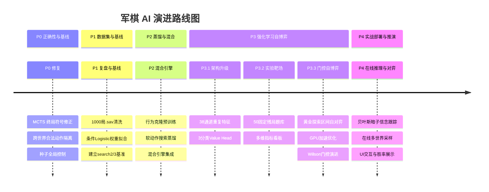

# 军棋翻棋推演引擎（junqi_engine）项目知识体系与理论架构手册

> **文档定位**：系统化沉淀本项目在**军棋翻棋（非确定性不完全信息博弈）**领域的理论建模、学术研究规律、深度强化学习架构、工程实现及避坑经验。

---

## 目录

1. [游戏本质与信息论建模](#1-游戏本质与信息论建模)
2. [学术研究基准与理论沉淀（Banqi / CDC AlphaZero）](#2-学术研究基准与理论沉淀)
3. [核心算法与网络架构（38通道 + 三分类 Value Head）](#3-核心算法与网络架构)
4. [项目演进路线与执行阶段总结（P0 ~ P4）](#4-项目演进路线与执行阶段总结)
5. [工程设计与高并发避坑指南](#5-工程设计与高并发避坑指南)
6. [项目目录结构与资产归类](#6-项目目录结构与资产归类)

---

## 1. 游戏本质与信息论建模

### 1.1 翻棋博弈分类
军棋翻棋（Chinese Dark Chess 变体，陆战棋 50 子翻棋模式）属于：
- **两人零和博弈（Two-Player Zero-Sum Game）**
- **非确定性（Non-deterministic / Stochastic）**：机会节点（Chance Node）来源于暗子翻开时的随机概率分布。
- **不完全信息（Imperfect Information）**：底牌分布对双方隐蔽，直到翻开或通过战斗推断。
- **循环与死区机制密集（Loop / Fortress Heavy）**：防守方可利用行营、地雷屏障与铁路构建死区防御，造成高比例和棋。

### 1.2 信息边界与公平性硬约束
根据项目全局基线（`AI_TRAINING_AND_HUMAN_PLAY_PLAN.md`），系统严格划分公共信息与隐藏信息：

```mermaid
graph TD
    A[真实物理牌局 (含50子真实底牌)] --> B(公共状态 Public State)
    A --> C(隐藏底牌 Hidden State)
    B --> D[公共策略网络 Policy Head]
    B --> E[贝叶斯暗子推断 Bayesian Belief]
    E --> F[确定化采样世界 Determinized Worlds]
    C -. 严禁直接读取 .-> D
    F --> G[价值网络 Value Head / 搜索反演]
```

- **公共状态（Public State）**：明子身份位置、暗子位置、已阵亡棋子全集、行营与铁路网、连续无吃子步数（70步和棋线）、局面重复计数（3次和棋线）。
- **公共策略网络（Public Policy）**：无论自对弈还是实战推断，Policy 输入**绝对严禁包含真实暗子身份**，保证输出动作先验的合法性与公平性。
- **采样世界（Determinized Worlds）**：从公共暗子池（`remaining_types`）中根据先验分布采样出的确定化棋局，仅在 Value 评估与战术树反演中用于跨世界期望聚合。

---

## 2. 学术研究基准与理论沉淀

本项目深度借鉴了暗棋/翻棋领域的两篇里程碑级学术研究：
1. **Hsueh, Wu, Chen et al. (2018)**: *AlphaZero for a Non-deterministic Game*
2. **JAIST CLAP (2023)**: *Analyses of Tabular AlphaZero on Strongly-Solved Stochastic Games*

### 2.1 核心理论发现与实证规律

#### 发现一：探索强度会放大循环，但不是当前和棋爆炸的唯一根因
- **现象**：在 2×4 小型可解暗棋与 5×12 军棋中，若直接采用围棋/国际象棋常见的超参（如 $c_{\text{puct}} = 2.5 \sim 5.0$），MCTS 在面对机会节点与隐蔽信息时会退化为**接近均匀随机搜索**。
- **后果**：随机走子极大增加了无意义的走子摆动与重复局面，最终被官方 3 次循环判和规则拦截，导致自对弈和棋率飙升至 95%+，梯度信号彻底稀疏化。
- **当前结论**：$c_{\text{puct}} = 0.6$ 与 $\epsilon = 0.20, \alpha = 0.15$ 可作为短周期基线，但参数本身不能解决历史盲区；本批在该参数下仍有 85/96 局重复和棋。

#### 发现二：历史重复特征平面是破除循环的必要条件
- 传统 AlphaZero 仅输入当前帧棋盘；但在具有 3 次循环判和的军棋中，AI 若看不到“当前局面已被访问过几次”，就无法在单帧前向传播中预判“下一步走棋将触发和棋”。
- **必要但不充分的方案**：输入张量需要 2 个布尔通道（`seen >= 1` 与 `seen >= 2`），同时必须把历史计数传给 MCTS 根节点、叶节点和树内终局判定。当前只完成了编码器与训练根样本，搜索决策链路尚未接通。

#### 发现三：三分类 Value Head 优于标量均方误差
- 标量 Value（$V \in [-1, 1]$）无法区分 **“均势死区和棋 ($V=0$)”** 与 **“极端不确定性 ($50\% \text{胜} + 50\% \text{负} = 0$)”**。
- **解决方案**：Value Head 输出三维未归一化分对数，经 Softmax 输出胜率 $P_{\text{win}}$、和率 $P_{\text{draw}}$、负率 $P_{\text{loss}}$，损失函数采用交叉熵（`CrossEntropyLoss`），标量期望按 $V = P_{\text{win}} - P_{\text{loss}}$ 换算。

---

## 3. 核心算法与网络架构

### 3.1 38 通道双模式状态编码器（`junqi/encoder.py`）

输入张量尺寸：`[Batch, 38, 12, 5]`（12 行 × 5 列）。

| 通道索引 | 语义名称 | 描述 |
|---|---|---|
| **0 ~ 11** | 己方明子分布 (12级) | 司令(12) 至 军旗(1) 的独热分布 |
| **12 ~ 23** | 敌方明子分布 (12级) | 司令(12) 至 军旗(1) 的独热分布 |
| **24** | 暗子位置掩码 | 全盘未翻开暗子位置（值为1） |
| **25** | 子力价值差平面 | $\sum \text{己方存活价值} - \sum \text{敌方存活价值}$ 全图广播 |
| **26** | 己方死区潜力 | 行营连通性与地雷保护屏障评估 |
| **27** | 敌方死区潜力 | 敌方死区与地雷保护屏障评估 |
| **28** | 铁路几何平面 | 铁路网坐标掩码 |
| **29** | 行营几何平面 | 双方共 10 个安全行营坐标掩码 |
| **30** | 工兵地雷全局状态 | 双方工兵存活数与敌方地雷清除进度 |
| **31** | 连续无吃子步数 | $\frac{\text{no\_capture\_plies}}{70}$ 归一化进度 |
| **32** | 总步数进度 | `ply / 1000` 归一化进度 |
| **33** | 暗子数量 | `hidden_count / 50` 归一化进度 |
| **34** | 阶段标记 | `0.0/0.5/1.0` 分别表示开局、中盘、尾盘 |
| **35** | 世界模式标志 | 0 = 公共信息模式, 1 = 采样确定化世界模式 |
| **36** (新) | **重复状态标志 1** | 当前可观察局面在历史上已出现 $\ge 1$ 次 |
| **37** (新) | **重复状态标志 2** | 当前可观察局面在历史上已出现 $\ge 2$ 次（临界和棋线） |

### 3.2 3650 维离散动作空间
- 翻子动作：50 个非行营坐标点索引（$0 \sim 49$）；
- 走子动作：$60 \text{起点} \times 60 \text{终点} = 3600$ 种可能移动；
- 总动作空间维度：$3650$。网络前向传播时使用 `legal_mask` 进行非法动作屏蔽。

### 3.3 双头残差卷积网络（`JunqiNet`）
- 主干：6 个 Residual Block（Conv2d + BatchNorm2d + ReLU + 残差连接），通道宽度 128；
- **Policy Head**：`Conv2d(128, 32, 1) -> BatchNorm -> ReLU -> Flatten -> Linear(32*60, 3650)`；
- **Value Head**：`Conv2d(128, 16, 1) -> BatchNorm -> ReLU -> Flatten -> Linear(16*60, 128) -> ReLU -> Linear(128, 3)`（输出 Win / Draw / Loss 三分类 logits）。

---

## 4. 项目演进路线与执行阶段总结



### 各阶段达成状态速查表

| 阶段代码 | 核心任务 | 现状 | 关键验收证据 |
|---|---|---|---|
| **P0** | 规则与 MCTS 价值符号正确性、确定化世界合法动作隔离、确定性复现 | ✅ 已完成 | 95/95 单元测试通过；强制吃旗与困毙专项测试通过 |
| **P1** | 1000 局 `.sav` 复盘数据清洗、特征权重拟合、建立 search2/3 参照基准 | ✅ 已完成 | 106,274 ply 清洗；Top-1 命中率 52.5%；形成标准评测集 |
| **P2** | 监督行为克隆、搜索教师软分布蒸馏、网络+传统搜索混合引擎 | ✅ 已完成 | 蒸馏模型全面压制纯随机与贪心，残局定式无崩溃 |
| **P3.1** | 38 通道重复历史平面改造、三分类 Softmax Value 价值头重构 | ✅ 已完成 | 兼容旧版 36 通道加载，支持三分类概率预测输出 |
| **P3.2** | 实验靶场构建（50题经典残局标杆）、自动化多维看板系统 | ✅ 已完成 | `junqi benchmark` 命令；`metrics/benchmark_dashboard.md` |
| **P3.3** | 门控自博弈强化学习闭环、GPU/CPU分工流水线 | ❌ 未通过长期挂机准入 | Epoch 3-5 为 1胜95和，重复和棋 85 局；候选 50 题全部预测 Draw |
| **P4** | 贝叶斯暗子信念跟踪、在线多世界采样搜索、GUI 实时胜率与求和 | 原型已交付，P4.4 未准入 | 详见 [docs/P4_EXECUTION_PLAN.md](P4_EXECUTION_PLAN.md) 的长期挂机准入复审 |

---

## 5. 工程设计与高并发避坑指南

### 5.1 Windows 环境多进程 CUDA 死锁陷阱
- **问题根源**：Windows 的 `multiprocessing` 使用 `spawn` 机制。如果子进程直接尝试调用 CUDA 驱动做神经网络推理，会导致 CUDA Driver Context 严重争用，甚至引发系统级死锁。
- **最佳实践**：
  - **自对弈 Worker（子进程）**：统一配置 `device="cpu"`，负责逻辑推演与轻量 CPU MCTS 搜索；
  - **网络训练与靶场批量测试（主进程）**：在主线程单进程下使用 `device="cuda"`（RTX 4080 SUPER），执行高吞吐的张量梯度更新与批量评估。

### 5.2 门控评测与 Wilson 置信区间
为防止在和棋密集的军棋中因小样本波动错误覆盖基线模型：
- 候选模型（Candidate）与生产发布模型（Best）完全分离；
- 门控使用固定种子、先后手各半、涵盖 `opening`、`midgame`、`endgame`、`random` 四阶段；
- 只有当候选模型的 Wilson 得分下界严格优于基线时才触发晋升（`promote`），门控未通过时保留候选权重持续演进，**绝不回滚训练进度**。

---

## 6. 项目目录结构与资产归类

```
junqi_engine/
├── junqi/                   # 核心代码包
│   ├── config.py            # 规则开关 (RuleConfig)、估值权重 (EvalWeights)、搜索超参
│   ├── rules.py             # 棋盘几何拓扑、铁路网、行营判定、战斗胜负裁决
│   ├── state.py             # 对局状态机、发牌、合法动作生成、JSON序列化
│   ├── encoder.py           # 38通道双模式状态张量化与 3650 维动作编解码器
│   ├── net.py               # 双头 Policy-Value 残差网络 (JunqiNet, 3分类Value)
│   ├── mcts.py              # PUCT 蒙特卡洛树搜索 (c_puct=0.6, Dirichlet噪声)
│   ├── train_rl.py          # 强化学习自博弈流水线 (P3.3 门控闭环)
│   ├── benchmark.py         # 实验靶场题库 (50标杆残局) 与自动化评测看板生成器
│   ├── ai.py                # 启发式估值、期望化搜索、NNAgent 深度学习代理
│   ├── selfplay.py          # 策略对战调度器 (NNStrategy / Search / Greedy / Random)
│   ├── replay.py            # 真实复盘 (.sav) 解码与规则一致性回放
│   ├── fit_weights.py       # 复盘数据行为克隆特征权重拟合
│   ├── tune.py              # 镜像自对弈爬山调优
│   ├── calculator.py        # 交互式局面分析计算器 CLI
│   └── gui.py               # Tkinter 人机对战图形界面
│
├── tests/                   # 单元测试与回归套件 (89 项全部通过)
│   ├── test_rules.py        # 规则边界与战斗逻辑测试
│   ├── test_replay.py       # 复盘数据解码测试
│   ├── test_rl.py           # 强化学习与 MCTS 正确性测试
│   └── test_p3_benchmark.py # P3 38通道、三分类网络与实验靶场测试
│
├── metrics/                 # 自动化指标看板与时序统计
│   ├── benchmark_dashboard.md # 实验靶场多维看板 (自动生成)
│   ├── value_mae.json       # 局面绝对误差详细数据
│   └── training_status.json # 训练进度时序快照
│
├── models/                  # 模型权重与对抗历史记录
│   ├── best.pt              # 当前发布的最高水平基准模型
│   ├── candidate_latest.pt  # 强化学习最新训练中候选模型 (含优化器与RNG状态)
│   └── elo_history.jsonl    # 训练轮次、Loss 与门控对抗时序日志
│
├── eval_sets/               # 固定评测集 (JSONL 格式)
│   ├── opening.jsonl        # 开局评测集
│   ├── midgame.jsonl        # 中盘评测集
│   └── endgame.jsonl        # 尾盘死区评测集
│
├── datasets/                # 复盘转换与蒸馏数据集
├── docs/                    # 理论方案、学术论文与更新日志
│   ├── CHANGELOG.md         # 详细项目更新日志
│   ├── PROJECT_KNOWLEDGE_AND_THEORY.md # 本项目知识体系与理论架构手册
│   └── *.pdf                # 经典参考学术论文
│
├── AGENTS.md                # 编码代理/大模型执行契约与硬约束
├── AI_TRAINING_AND_HUMAN_PLAY_PLAN.md # 项目执行总基线方案 (P0-P4)
└── README.md                # 项目快速入门与功能总览
```
