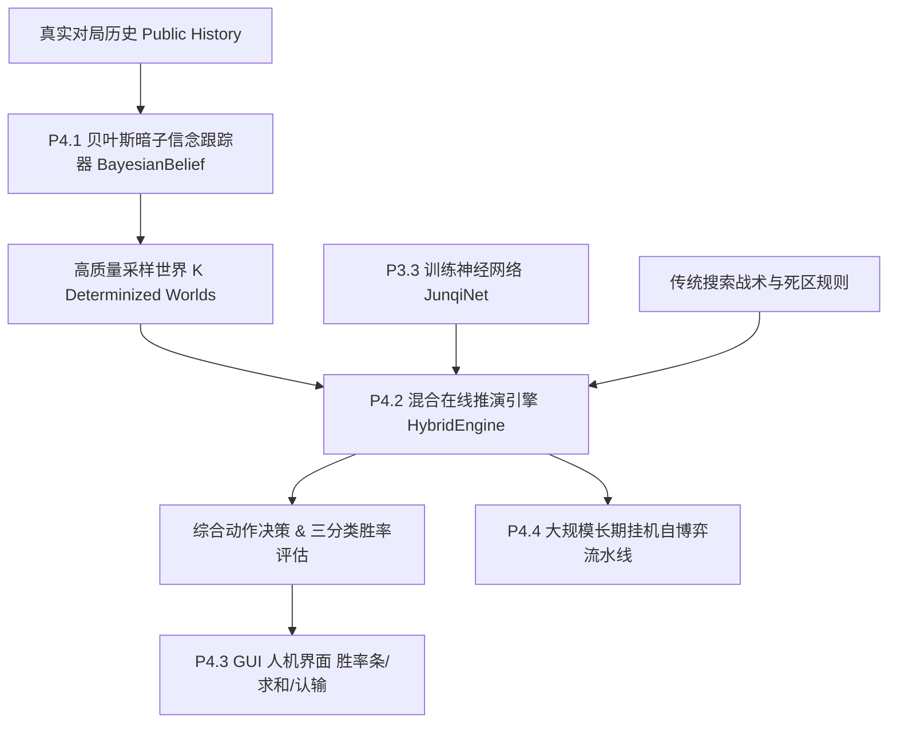

# 军棋翻棋 P4 阶段：实战对弈、在线多世界推演与系统集成执行方案

> **阶段定位**：`P4`（从离线强化自博弈向**在线实战推演、不完全信息贝叶斯推理与 GUI 交互集成**演进）  
> **基线文档**：对齐 [`AI_TRAINING_AND_HUMAN_PLAY_PLAN.md`](../AI_TRAINING_AND_HUMAN_PLAY_PLAN.md)  
> **更新日期**：2026-09-01

## P4.4 长期挂机准入复审与开启条件（2026-09-01）

**审查结论：不通过。当前处于 `P3 收尾 / P4 准入复审`，不得启动 P4.4 长期挂机训练。**

P4.1-P4.3 的接口原型可以继续短周期验证，但“原型可运行”不等于 P3 训练信号稳定，也不等于 P4.4 已准入。最近三轮门控没有产生可用于证明棋力提升的证据，反而暴露出重复循环和 Value Draw 塌缩。

**最新状态更新（Epoch 6）**：重复和棋已从 85/96 降为 0/32，说明历史重复链路修复有效；但候选门控仍为 1 胜 / 30 和 / 1 负、`promoted=false`，对 `search2` 参考得分仅 `0.25`。Value MAE 进一步升至 `0.5690`、三分类准确率降至 `20.0%`，预测为 0 Win / 35 Draw / 15 Loss。结论仍是**不得开启长期挂机**。

**2026-09-01 深度审查与 S0/S1 整改**：完整根因分析（含 best.pt 基线污染、门控统计功效死锁、对手池失效、Value 模式失配等五层根因与 AlphaZero/Lc0/KataGo/PSRO 对标）见 [`docs/TRAINING_ROOT_CAUSE_REVIEW.md`](TRAINING_ROOT_CAUSE_REVIEW.md)。其中 **S0（靶场标签修正、基线重建、基线快照）与 S1（门控判据修订、对手池无条件注入与占比日志、删除对手 one-hot 策略目标、Elo 与晋升解耦）已实施并通过 112/112 单测与端到端冒烟**；**S2（公共模式 Value 样本、专家价值蒸馏、决胜课程与中盘注入、辅助回归锚定、温度上调）也已实施，124/124 单测通过**；Value 健康度、自动熔断、中等规模稳定性仍未通过（待 S3 复验），禁令保持。

### 复审批次与证据

| 检查项 | 实测结果 | 判断 |
|---|---|---|
| **全量回归** | 使用项目 `venv` 执行，**95/95** 单元测试通过 | 必要条件通过，但现有测试未覆盖 NN 门控的历史重复集成链路 |
| **Epoch 3-5 门控** | **1 胜 / 95 和 / 0 负**，三个候选均 `promoted=false` | 不能证明候选强于 `best.pt`，不满足晋级要求 |
| **终局原因** | `repetition=85`、`no_capture=10`、`immobilized=1` | 88.5% 对局由重复判和结束，主要是策略循环而非正常胜负收敛 |
| **50 题 Value 靶场** | MAE `0.4223`、三分类准确率 `50.0%`；开局/中盘/尾盘 MAE 分别为 `0.1584/0.4465/0.6022` | 全部未达到看板目标，且中残局明显退化 |
| **候选类别分布** | 题库真值为 17 Win / 25 Draw / 8 Loss；候选对 **50/50 全部预测 Draw** | `50.0%` 准确率来自题库恰有 25 道 Draw，不是模型判断能力达到 50% |
| **候选 Draw 概率** | 中盘平均 `99.86%`，尾盘平均 `99.74%` | Value Head 已出现严重 Draw 塌缩 |
| **模型与回放统计** | `candidate_latest.pt` 与 `_candidate_gate.pt` 参数完全一致；Policy 样本 19,318，Value 样本 153,989 | 当前落盘候选就是本次塌缩模型，不能作为长期训练起点 |

### 初始“1 胜 95 和”的主要原因（整改前）

以下内容用于保留初始事故根因；当前落地状态以“恢复长期挂机准入的整改推进情况”和后续启动硬门槛表为准。

1. **NN 门控策略丢弃 `avoid`。** `selfplay.play_game()` 已计算即将触发第三次重复的局面键并传给策略，但 `NNAgent.choose_actions()` 接收 `avoid` 后未使用，直接调用 `MCTS.search()`。固定局面复查也确认，把首选动作的后继局面加入 `avoid` 后，NN 仍选择同一动作。
2. **MCTS 的 Policy target 对重复历史无感。** 训练循环只把 `history_counts=seen` 写进保存的根状态；`MCTS.search()` 没有历史参数，根节点、叶子网络推理和树内终局判定均看不到真实重复次数。因而通道 36/37 虽已存在，生成动作分布的搜索仍无法知道某一步会直接判和。
3. **Draw 标签形成自增强闭环。** 自博弈把规则和棋的全部叶子样本标为 Draw；当绝大多数对局都是循环和棋时，Value Buffer 被 Draw 标签主导，网络进一步把胜局、败局和普通中盘都判为 Draw，再反过来让 MCTS 接受循环线。
4. **计划中的多样化对手池没有进入训练 Worker。** `pool_models` 初始只有 `best.pt`，仅在候选晋升后添加历史快照；本批所有候选均未晋升，因此实际长期是高度对称的当前模型自对弈。`greedy/search2/random` 只存在于通用策略工厂或参考评测，没有作为训练对手进入 Worker。
5. **固定种子与确定性门控会稳定复现相同缺陷。** 固定门控种子适合横向比较，但在 NN 无历史规避、极低温度且无搜索噪声时，会逐轮重放相近循环。它不是根因，却放大了结果的重复性。
6. **P4 原型没有参与这 96 局训练或门控。** `HybridDecisionEngine` 仅接入 GUI，未注册为训练/门控策略；因此 P4.1-P4.3 原型的存在不可能改善本次门控结果。

### 初始 P4.1-P4.3 审查边界（整改前）

- `HybridDecisionEngine.evaluate_position()` 每次调用都会 `tracker.reset(state)`，无法保留跨回合后验；GUI 也没有持续调用 `BeliefTracker.on_action()`。
- 当前翻棋规则是全盘随机洗牌，`BeliefTracker` 却引入军旗/地雷偏向己方底排和大本营的布阵先验；该先验尚无 1000 局复盘统计证据，并与当前发牌机制冲突。
- `on_action()` 的“攻击暗子后更新信念”分支在当前规则下不可达，因为合法动作禁止攻击未翻开的暗子。
- 当前混合引擎主要平均多世界 Policy，Value 只用于展示；尚未实现逐动作多世界搜索和 Value 聚合，不能据此宣称 PIMC/ISMCTS 棋力验收完成。

### 恢复长期挂机准入的整改推进情况

| 整改步骤 | 落地状态 | 对应代码与验证证据 |
|---|---|---|
| **1. history_counts/avoid 全链路闭环** | **已完成** | `junqi/mcts.py`（树内 3 次重复判和 + 根节点硬惩罚）、`junqi/ai.py`（透传 avoid/history）、`junqi/selfplay.py`（seen 计数透传）。`tests/test_p4_audit_fixes.py` 专项单测通过。 |
| **2. Value 经验池类别均衡与序列化** | **已完成** | `junqi/train_rl.py` 中 `StratifiedReplayBuffer` 拆分为 Win/Draw/Loss 三分桶，1/3 类别等权抽样；支持 `save/load` 真实经验池序列化文件（`_buffer.pkl`）。 |
| **3. Worker 多样化对手池接入** | **部分完成** | Worker 已实现镜像、网络、专家/贪心和随机分支；但 `pool_models` 只有 `best.pt` 时不会向 Worker 传入 `net1`，实际 25% best 占比尚未成立，也缺少逐轮实际对手占比日志和集成测试。 |
| **4. 贝叶斯信念先验校准** | **已完成** | `junqi/belief.py` 校准初始先验为翻棋规则的精确全盘均匀边缘分布 `state.marginal()`，移除暗子攻击不可达代码；`junqi/hybrid_engine.py` 支持持续后验跟踪。 |
| **5. 32 局短周期冒烟复验** | **循环专项通过，Value 未通过** | 重复和棋率由 88.5% 降至 0/32；但 Value MAE `0.5690`、准确率 `20.0%`，且无 Win 预测，不能把“非单一类别”解释为训练信号健康。 |
| **6. 正式多轮门控评估与晋升** | **未通过** | Epoch 6 门控 1 胜 / 30 和 / 1 负，`promoted=false`；尚未完成修复后的 3-5 轮中等规模稳定性验证和每场景至少 200 局的正式门控。 |

### 长期训练必须区分两个开关

长期训练有两个互不替代的授权：

1. **训练启动开关**：只证明闭环正确、稳定、可恢复，可以开始后台持续产样本；
2. **自动晋升开关**：证明候选棋力和 Value 质量确实改善，才允许覆盖 `best.pt`。

训练启动获准不代表候选可以晋升；单元测试全绿、loss 下降或某轮没有重复和棋，也不能替代这两个门槛。

#### A. 长期训练启动硬门槛

| 硬门槛 | 量化标准 | 当前状态 |
|---|---|---|
| **历史重复决策闭环** | NN、MCTS 根/叶、树内终局和自对弈统一接收历史；第三次重复动作必须被规避或按 Draw 终局处理 | 已通过专项测试 |
| **正确性与可复现性** | 全量测试及新增集成测试 100% 通过；固定种子非法动作数为 0 | 99/99 通过 |
| **短周期循环控制** | 固定种子 32-64 局中 `repetition < 5%`，且不能靠提前中止或改规则实现 | 0/32，达到样本下限 |
| **Value 健康度** | 50 题中任一预测类别占比 `<90%`；相对选定启动基线，MAE 不得恶化 `>0.05`、准确率不得下降 `>5` 个百分点；Win/Draw/Loss 必须都有可学习信号 | 未通过：MAE `0.5690`、准确率 `20.0%`、Win 预测为 0 |
| **真实对手多样性** | 当前模型、`best.pt`、历史快照、`greedy/search2`、少量 `random` 实际进入 Worker；日志记录实际占比，和配置偏差不超过 10 个百分点 | 部分完成，待实际占比验证 |
| **完整断点恢复** | 模型、优化器、随机状态、配置和真实 Replay Buffer 均可恢复；中断恢复后固定种子结果一致 | Buffer 序列化单测通过，仍需一次训练中断恢复演练 |
| **自动熔断** | 训练主循环能按下表阈值自动暂停并保留故障现场，而不只是输出告警字段 | 未实现自动暂停 |
| **中等规模稳定性** | 修复后连续 3-5 个 Epoch、每轮 64-120 局，所有指标不触发熔断且无持续退化 | 未执行 |

**开启规则**：上表全部通过后，才可把每轮对局数提升到 120-200 并进入长期后台训练。当前最少还缺 Value 健康度、真实对手占比验证、自动熔断和中等规模稳定性四项。

#### B. `best.pt` 自动晋升门槛

自动晋升必须在长期训练启动门槛之外，再同时满足：

- `opening`、`midgame`、`endgame`、`random` 每个场景总计至少 200 局，先后手各半；参数配置时必须注意 `evaluate_gate()` 的 `games_per_side` 是单边局数；
- 整体得分 `>=0.5`，且不败率 Wilson 下界 `>=0.5`；
- 任一场景得分不得低于 `0.30`；
- 至少一个场景得分的 Wilson 下界 `>0.5`，证明存在统计显著改善；
- 相同计算预算下对 `greedy/search2/search3` 不得退化，并拆分报告胜、和、负及终局原因；
- 50 题不得触发类别塌缩，Value MAE、三分类准确率和分阶段误差不得低于启动基线；发布级目标仍按看板执行：总体 MAE `<0.1500`、准确率 `>85%`；
- 非法动作、NaN、规则偏移、信息泄漏和不可复现次数均为 0。

在 Value 指标尚未接入 `decide_promotion()` 的硬门控前，即使对局 Wilson 条件通过，也不得自动覆盖 `best.pt`。

### 长期训练自动熔断规则

| 监控项 | 告警阈值 | 自动暂停阈值 |
|---|---:|---:|
| `repetition` 占比 | 单轮 `>=5%` | 单轮 `>=10%`，或连续两轮 `>=5%` |
| Value 单类预测占比 | `>=80%` | `>=90%` |
| Value MAE | 相对启动基线上升 `>0.02` | 上升 `>0.05` |
| 三分类准确率 | 相对启动基线下降 `>2` 个百分点 | 下降 `>5` 个百分点 |
| Win/Loss 学习信号 | 单轮任一类别为 0 | 连续两轮无胜负样本 |
| 对手实际占比 | 与配置偏差 `>5` 个百分点 | 偏差 `>10` 个百分点或某类对手未运行 |
| 工程正确性 | 可恢复告警 | 非法动作、NaN、检查点/Buffer 恢复失败立即暂停 |

熔断后必须保留候选、经验池、随机状态、配置和最近一轮对局记录；禁止自动清空后重新训练，也禁止覆盖 `best.pt`。

### 从当前状态到长期训练的动作顺序

1. **选定干净启动基线**：分别评测 `best.pt`、`bc_best.pt` 和修复后的候选；旧的全 Draw 候选不得作为长期训练起点。记录模型哈希和基线指标。
2. **补齐剩余工程门槛**：记录 Worker 实际对手类型和占比；增加多样化对手集成测试；把 `collapse_warning`、重复率、MAE 退化和异常状态接入训练主循环自动暂停；把 Value 指标纳入晋升否决条件。
3. **完成短周期复验**：在现有 32 局基础上补足到 64 局，确认 `repetition <5%`、非法动作 0，并执行一次中断恢复演练。
4. **进行中等规模验证**：连续 3-5 个 Epoch、每轮 64-120 局，固定种子，逐轮记录对手占比、胜和负、终局原因、Value 类别分布、MAE、准确率和 MCTS 访问熵。
5. **开启长期训练**：只有中等规模验证无熔断后，才提升到每轮 120-200 局；仍保持每轮快速门控和定期正式门控。
6. **独立执行自动晋升**：累计足够样本后按上述每场景至少 200 局协议评测，满足全部 Wilson、基线和 Value 条件后才更新 `best.pt`。

### 和棋指标的解释边界

- 总和棋率不单独作为长期训练否决项，因为军棋本身存在大量合法死区和棋；
- `repetition` 是策略循环指标，应严格控制在 `<5%`；
- `no_capture` 需要结合物质差、死区和可破局动作分析，不能直接作为错误标签删除；
- 所有合法规则和棋仍保留真实 Draw 标签，只能通过分层采样、类别权重和对手多样性改善训练信号，禁止篡改终局奖励。

---

## 一、 P4 阶段总览与子任务划分

在 P0（正确性）、P1（复盘基线）、P2（蒸馏混合）与 P3（门控自博弈闭环）全部验收完成后，P4 的核心目标是**将强大的离线神经网络与在线不完全信息推理、对手建模及图形交互完整打通**。



| 子阶段 | 模块命名 | 核心任务 | 交付物 |
|---|---|---|---|
| **P4.1** | `junqi/belief.py` | 贝叶斯暗子信念跟踪与对手建模 | 逐格暗子概率矩阵、条件信念更新、加权采样器 |
| **P4.2** | `junqi/hybrid_engine.py` | 在线多世界采样与混合战术推演 | 神经网络先验 + 战术剪枝 + PIMC 期望决策 |
| **P4.3** | `junqi/gui.py` | GUI 胜率预测条与智能对弈交互 | 动态胜/和/负概率条、智能求和响应、AI 推荐步 |
| **P4.4** | `junqi/train_rl.py` | 长期大规模自博弈与自动化晋升 | 长期后台挂机脚本、历史对手池、自动化评测流水线 |

---

## 二、 P4.1 贝叶斯暗子信念跟踪器（`junqi/belief.py`）

### 1. 数学建模
全盘共有 50 个非行营格点。设 $C_{\text{hidden}}$ 为当前所有未翻开暗子坐标集合，$T_{\text{pool}}$ 为公共已知剩余暗子多重集（由全部 50 子减去已明子和已阵亡子得出）。

对于任意未翻开暗子位置 $u \in C_{\text{hidden}}$，维护其后验概率分布：
$$P(PieceType = t \mid u, \mathcal{H})$$
满足约束：
$$\sum_{t} P(PieceType = t \mid u, \mathcal{H}) = 1, \quad \forall u$$
$$\sum_{u \in C_{\text{hidden}}} P(PieceType = t \mid u, \mathcal{H}) = \text{Count}(t \in T_{\text{pool}}), \quad \forall t$$

### 2. 行为特征与先验更新规则
1. **布阵位置先验（Layout Prior）**：
   - 统计 1000 局真实复盘中地雷、军旗、炸弹在底二排与边角的出现频率作为初始先验分布。
2. **移动避让与威慑先验（Evasion Prior）**：
   - 若敌方某明子（如师长）原本可走入某暗子周围却主动绕开，则该暗子为炸弹/司令/地雷的后验概率提升。
3. **冒进先验（Aggression Prior）**：
   - 若敌方明子（如连长）主动冲击某暗子，表明该暗子大概率为较小棋子或非地雷。
4. **采样一致性生成（Determinization Sampling）**：
   - 使用 Sinkhorn / 启发式加权无放回抽样算法，从概率矩阵中高效采样出 $K$ 个满足全盘子力守恒的确定化世界。

---

## 三、 P4.2 在线多世界采样与混合决策引擎（`junqi/hybrid_engine.py`）

### 1. 架构设计
解决传统 PIMC（完美信息蒙特卡洛）“非局部策略失效”与单一网络“暗子计算盲区”的矛盾：

```
                    ┌── 采样世界 1 ── JunqiNet (CUDA batch) ── 战术校验 ──┐
公共状态 ── 贝叶斯采样 ├── 采样世界 2 ── JunqiNet (CUDA batch) ── 战术校验 ──┼──> 跨世界动作聚合 (Top-1 Action)
                    └── 采样世界 K ── JunqiNet (CUDA batch) ── 战术校验 ──┘
```

### 2. 战术约束与硬规则过滤
在神经网络输出 Policy Logits 后，执行轻量战术规则拦截：
- **强制吃旗（One-step Flag Capture）**：合法动作中存在可吃军旗步骤时，直接作为最高优先级动作输出。
- **强制困毙（Immobilization Check）**：若某移动可直接造成对手无合法子力可动，优先执行。
- **自杀与无谓损耗拦截**：利用完全信息战术表，过滤掉明确撞雷或送大子的低级失误。
- **循环判和规避**：对历史 `seen >= 2` 的局面施加惩罚项，避免在优势局面下被动和棋。

---

## 四、 P4.3 GUI 胜率预测与智能人机交互增强（`junqi/gui.py`）

### 1. 实时胜率可视化
在游戏主界面右侧增加 **AI 实时态势评估面板**：
- **胜率条（Win / Draw / Loss Bar）**：
  - 绿色：胜率 $P_{\text{win}}$（例如 `62.5%`）
  - 灰色：和率 $P_{\text{draw}}$（例如 `30.0%`）
  - 红色：负率 $P_{\text{loss}}$（例如 `7.5%`）
- 界面每走一步自动调用神经网络进行轻量评估并平滑动画更新。

### 2. 人机交互：求和与认输仲裁
- **玩家求和（Offer Draw）**：
  - 当玩家点击“求和”按钮时，AI 根据当前局势评估：若 $P(\text{draw}) \ge 0.60$ 或 $P(\text{loss}) \ge 0.70$（AI处于劣势或均势死区），AI 欣然同意和棋；若 AI 占绝对优势（$P(\text{win}) > 0.75$），AI 礼貌拒绝并继续对局。
- **AI 主动求和 / 提和响应**：
  - 连续 40 步无吃子且进入双死区时，AI 可提示玩家和棋。

---

## 五、 P4.4 长期自博弈强化学习挂机演进（`junqi/train_rl.py`）

> **当前状态：禁止启动。** 下列配置仅是启动硬门槛全部通过后的容量规划，不是当前可执行命令；自动晋升还必须另行满足本文件顶部的晋升门槛。

### 1. 演进目标与硬件配置
- **硬件支持**：利用用户配备的 NVIDIA GeForce RTX 4080 SUPER GPU 进行持续自博弈演进。
- **训练超参推荐**：
  - 每轮对局数：`games = 120 ~ 200`
  - MCTS 模拟次数：`sims = 60 ~ 100`
  - 并发进程数：`workers = 6 ~ 8`
  - 经验池容量：`buffer_size = 40,000`
  - 逐轮快速门控：`eval_games = 12 ~ 20`（仅用于早停监控，不构成正式晋级证据）

### 2. 自动化看板与时序归档
- 每轮训练完成自动归档到 `models/candidate_latest.pt` 与 `metrics/benchmark_dashboard.md`；
- 记录 Elo 分数演进曲线，达到晋级阈值时自动晋升为 `models/best.pt`。

---

## 六、 P4 阶段验收标准

1. **贝叶斯信念准确度**：在 1000 局真实复盘测试集上，贝叶斯暗子矩阵对实际暗子军衔的对数似然（Log-Likelihood）显著优于均匀随机猜测。
2. **实战混合引擎棋力**：在同等耗时（每步 $\le 0.5$ 秒）下，`HybridEngine` 对传统 `search2` 取得 $\ge 60\%$ 胜率（不含和棋），无低级送子与卡死现象。
3. **GUI 交互流畅度**：界面胜率条与求和响应零卡顿，残局态势判断准确直观。
4. **单测覆盖率**：新增 P4 单元测试，全量单测保持 100% 通过。
