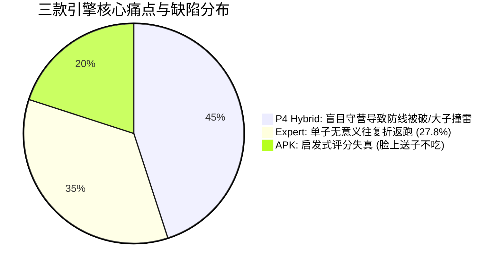
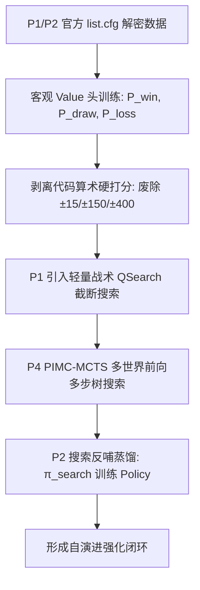

# 军棋翻棋 AI 实战复盘、根因剖析与根本性改良系统规划方案
**文档状态**：多方技术审查基准 (Multi-Stakeholder Review Draft)  
**更新日期**：2026-09-13  
**执行基线**：符合 [AI_TRAINING_AND_HUMAN_PLAY_PLAN.md](../AI_TRAINING_AND_HUMAN_PLAY_PLAN.md) 与 [AGENTS.md](../AGENTS.md) 约束规范  
**归属阶段**：P1（传统搜索增强与专家评估校准） / P2（真实 Value 与搜索蒸馏） / P4（混合智能与在线决策）

---

## 目录
1. [会话背景与实战复盘实录](#1-会话背景与实战复盘实录)
   - 1.1 人机 40 手翻棋基准对弈（Seed: 884811）与 LLM 空间几何局限
   - 1.2 三款本地引擎横向对抗复盘 (`expert` / `p4_hybrid` / `apk`)
   - 1.3 典型严重缺陷与战术失误详查
2. [底层病灶根因剖析（Root Cause Analysis）](#2-底层病灶根因剖析root-cause-analysis)
   - 2.1 代码硬打分机制对神经网络 Policy 的绝对淹没（量纲崩溃）
   - 2.2 1-ply 浅层反杀检测与多步战术的地平线效应（Horizon Effect）
   - 2.3 经验权重的“规则踩踏（Heuristic Gridlock）”
3. [他山之石：世界顶级棋类 AI 的根本性解决范式](#3-他山之石世界顶级棋类-ai-的根本性解决范式)
   - 3.1 国际象棋：Stockfish 从手写评估到 NNUE 革命与 QSearch 截断
   - 3.2 围棋/完全信息：AlphaZero / KataGo 的双头网络与 MCTS 涌现
   - 3.3 不完全信息博弈：微软 Suphx / 德扑 Pluribus 的信念建模与搜索蒸馏
4. [军棋翻棋工程根本改良系统规划（三步走落地路线）](#4-军棋翻棋工程根本改良系统规划三步走落地路线)
   - 4.1 第一阶段：打分基准客观化（废除“加减几百分”，回归真实终局胜率 Value）
   - 4.2 第二阶段：构建带静态截断搜索（QSearch）与 PIMC-MCTS 的深度前向计算
   - 4.3 第三阶段：搜索反哺神经网络（搜索蒸馏与自博弈自进化闭环）
5. [多方技术审查要点与决策清单（Review Checklist）](#5-多方技术审查要点与决策清单review-checklist)
   - 5.1 算力开销与在线响应延迟预算
   - 5.2 评估门控指标与和棋死锁规避
   - 5.3 分阶段工程里程碑与验收标准
6. [审查结论与下一步执行建议](#6-审查结论与下一步执行建议)

---

## 1. 会话背景与实战复盘实录

### 1.1 人机 40 手翻棋基准对弈（Seed: 884811）与 LLM 空间几何局限
在固定种子 `Seed: 884811` 的 40 手基准对弈中，人类玩家与通用大模型（LLM）展开了开局对抗。
实测暴露出通用大模型以纯自然语言形式进行棋类决策的核心瓶颈：
- **纯文本拓扑盲区**：无法在无博弈树前向模拟（Lookahead）的前提下感知公铁两用路网、行营跳跃、多子联动等复杂空间几何；
- **决策退化**：在没有搜索树剪枝和状态机强制约束时，容易生成非法移动或顾此失彼的战术动作。

### 1.2 三款本地引擎横向对抗复盘
用户调取了本地运行生成的三个典型对局日志进行多方审查：
1. **专家搜索 (`games/game_20260913_151832.json`)**
2. **P4 混合智能 (`games/game_20260913_152127.json`)**
3. **原生 APK 逆向对齐引擎 (`games/game_20260913_152345.json`)**

各引擎在实战中呈现出鲜明的特征与严重的系统性缺陷：



### 1.3 典型严重缺陷与战术失误详查

#### (1) P4 混合智能：第 141 手军长撞炸弹，第 150 手后行营小子对炸弹不管不顾
- **现象复现**：
  - 第 141 手：军长直接开向敌方明炸弹正前方，随后被炸弹同归于尽白兑；
  - 第 150 手起：敌方炸弹在铁路上逐步逼近己方地雷和军旗，己方行营内驻扎着排长和连长，却对炸弹视而不见，拒不出营拦截。最终敌方炸弹直接在脸上将关键地雷炸除，后方敌方工兵紧随其后长驱直入拔旗。
- **机制回溯**：
  - 在 `junqi/hybrid_engine.py` 中，出营动作被粗暴施加了硬惩罚：
    ```python
    if leaves_camp:
        if tgt.rank not in (Rank.QI, Rank.SI, Rank.JUN):
            score -= 150.0  # 小子弃营吃小子/兑子，重度惩罚扣 150 分！
    ```
  - 模型缺乏 2~3 步的树搜索预测，完全看不到“再过两步地雷被炸将直接导致失分输棋”的长程因果，受限于“出营直接扣 150 分”的人工死规则，宁可守着行营等死，也不愿主动出营拆弹。

#### (2) 原生 APK 移植引擎：第 23 手红排长失误送脸不吃
- **现象复现**：
  - 敌方红排长原本要进营走错格子，直接暴露在己方团长攻击范围内（白送）。己方团长明明可以直接吃掉敌方排长，系统却选择在远端盲目翻开一枚暗子。
- **机制回溯**：
  - 根节点不同动作的打分“货币”脱节：翻棋打分采用 0-ply 静态启发式硬加分（`base + 140`），而吃排长被各种复杂的机动性/反扑公式折算后得分仅为 `base - 10`。
  - 人工制定的打分权重彻底扭曲，导致系统认为“去翻一个位置不确定的暗子”比“净吃对方一个明子”价值更高。

#### (3) 专家搜索模型：单子往复折返跑占比高达 27.8%
- **现象复现**：
  - 盘中大量步数由单个棋子在两个安全格之间来回移动。
- **机制回溯**：
  - 搜索深度受限，未触及有效剪枝边界；
  - 静态评估函数对没有吃子和占营的过渡步给出的评价值完全相同，导致打分震荡，陷入局部极值和无意义折返。

---

## 2. 底层病灶根因剖析（Root Cause Analysis）

用户一针见血地指出：
> “这些都只是很表面的问题，重点是模型完全是通过代码强制评分，而没有多步的深入计算，另外打分标准是否合理也无从得知，这些问题才是模型得不到提升的根因。”

从决策系统架构角度，当前系统的根因可归纳为三大致命死锁：

### 2.1 代码硬打分机制对神经网络 Policy 的绝对淹没（量纲崩溃）
在当前代码 [`junqi/hybrid_engine.py`](file:///e:/Local%20code/军棋/junqi_engine/junqi/hybrid_engine.py#L190-L335) 中：
- 神经网络 Policy 经过 Softmax 后输出的是严格的概率分布：$P(a|s) \in [0.0, 1.0]$；
- 随后代码中硬编码的启发式战术补丁进行算术加减：
  ```python
  score += 10000.0  # 吃旗
  score -= 500.0    # 撞大子自杀
  score -= 400.0    # 面临反杀
  score -= 150.0    # 小子弃营
  score += 50.0     # 吃子
  score += 15.0     # 辐射翻棋
  ```
- **病因实质**：数十到数百的整数加减，在量纲上比 Policy 概率大了 **2~4 个数量级**。神经网络辛辛苦苦训练出的特征提取和走法先验，被几行简单的加减法彻底抹杀。系统实质上退化成了纯手工 if-else 规则系统。

### 2.2 1-ply 浅层反杀检测与多步战术的地平线效应（Horizon Effect）
当前系统为了检测风险，仅编写了 1-ply 的反杀检测：
```python
# 仅检查：执行该动作后，下一手敌方明子是否能在目标格反杀
for opp_a in nxt.legal_actions():
    if opp_a.kind == "move" and opp_a.to == a.to:
        # 1-ply 反杀检测
```
- **病因实质**：
  1. 军长走到炸弹脸上：军长这一步并没有吃掉炸弹，炸弹在这一手还没有移动，1-ply 检测判定“目标格没有敌方反扑”，判定安全；
  2. 炸弹沿铁路逼近地雷：第 1 步炸弹还在铁路上，距离地雷尚有 1 步距离，1-ply 检测发现地雷没有被吃，判定“天下太平”；
  3. **在多步棋类博弈中，1-ply 贪心等于深度近视眼**。任何需要 2 步及以上展开的战术（串打、抽将、兑子掩护、弃子破阵），在 1-ply 视野下全是绝对盲区。

### 2.3 经验权重的“规则踩踏（Heuristic Gridlock）”
- 启发式打分（“出营扣 150”、“进营加 25”、“翻棋加 15”）缺乏客观数学标定；
- 规则之间不可避免地产生严重踩踏：
  - 为了防止乱出营，设了 `-150` 惩罚；
  - 导致炸弹贴脸拆雷时，防守子因 `-150` 拒不出营；
  - 若再打补丁“如果炸弹逼近地雷则出营不扣分”，又会引发工兵偷旗漏防等连锁 Bug；
  - 这种“打地鼠式”修补在软件工程中已被证明不可维系，系统复杂度指数爆炸，最终导致行为失控。

---

## 3. 他山之石：世界顶级棋类 AI 的根本性解决范式

历史上，国际象棋、围棋、将棋、麻将（微软 Suphx）、德州扑克（Pluribus）均经历过一模一样的手写规则瓶颈。它们的根本性突破路径如下：

```
[传统规则时代]                   [现代架构突破]
手工打分公式 (5000+ 规则)   ───►  NNUE / 深度 Value (自博弈/复盘数据拟合胜率)
1-ply 静态启发式            ───►  QSearch (静态截断) + MCTS/Alpha-Beta (深层前向模拟)
人工写死战术权重            ───►  战术在博弈树中自然涌现，搜索作为教师反向蒸馏先验
```

### 3.1 国际象棋：Stockfish 从手写评估到 NNUE 革命与 QSearch 截断
- **NNUE 革命**：彻底废弃包含数千条人工打分规则（车占开线、孤兵、王安全等）的评估函数，改用浅层神经网络直接输入棋盘局面，输出期望胜率。**网络参数全部从海量高质量对局和自博弈中学习得到，没有人为拍脑袋的加减分**。
- **Quiescence Search（静态截断搜索，QSearch）**：
  - 当主搜索达到最大深度限制时，**绝不直接调用评估函数打分**；
  - 只要当前局面存在吃子、兑子、将军等剧烈战术动作，QSearch 强制继续向前单线展开所有吃子走法；
  - 直到棋局进入“安静状态（Quiet Position）”，没有任何即将发生的子力交换，才调用评估；
  - **这一机制 100% 消灭了地平线效应**，绝不可能发生“把大子开到敌人攻击点上还以为自己很赚”的低级错误。

### 3.2 围棋/完全信息：AlphaZero / KataGo 的双头网络与 MCTS 涌现
- **无中间奖励（Zero Intermediate Reward）**：
  - 彻底抛弃吃子加分、围空加分等中间奖励，**只保留终局胜负平 $Z \in \{+1, 0, -1\}$**；
- **Policy/Value 双头网络**：
  - Policy $P(a|s)$：提供走法先验，负责剪枝，将搜索分枝从全动作压缩到最具希望的少数动作；
  - Value $V(s)$：直接预测当前状态的终局期望胜率；
- **MCTS 树搜索（战术自动涌现）**：
  - 军长走到炸弹面前，MCTS 在前向展开的第 2 层就会触发炸弹同归于尽，导致该分支终局胜率大跌；
  - 负价值反向传播回根节点，军长这步棋的访问次数 $N(s, a)$ 瞬间被压制为 0。**全程无需写一行“炸弹扣 350 分”的代码，战术避险在树搜索中自然涌现**。

### 3.3 不完全信息博弈：微软 Suphx / 德扑 Pluribus 的信念建模与搜索蒸馏
- **Suphx（微软日麻登顶天凤十段）**：
  - 不完全信息博弈中，隐藏信息无法直接看到，但**牌池与弃牌历史构成全局约束**；
  - 引入 PIMC（Perfect Information Monte Carlo）多世界确定化采样；
  - **搜索蒸馏（Search as a Teacher）**：在训练阶段，用深层前向搜索产生的高质量决策分布 $\pi_{\text{search}}$ 反向蒸馏给神经网络 Policy，使网络即使在单步推理时也能具备深层战术前瞻直觉。

---

## 4. 军棋翻棋工程根本改良系统规划（三步走落地路线）

根据 [`AI_TRAINING_AND_HUMAN_PLAY_PLAN.md`](../AI_TRAINING_AND_HUMAN_PLAY_PLAN.md)（P0~P4 规划）与 [`AGENTS.md`](../AGENTS.md) 硬约束，本次系统重构方案分为三个清晰阶段：



### 4.1 第一阶段：打分基准客观化（废除“加减几百分”，回归真实终局胜率 Value）

#### (1) 激活已破译的 800+ 官方真实终局复盘数据
- 2026-09-06 逆向破译官方数据库 `军旗复盘/list.cfg`（DES-ECB 加密），确认真实终局分布：
  - 绝杀终局（code 1）：69 局
  - 主动认输（code 21）：456 局（子力崩塌瞬间认输，具高置信度胜负 Value 标签）
  - 官方协议和棋（code 40）：265 局（正规和棋 Value = 0）
- **实施要点**：
  - 丢弃旧版“因无法判定终局而把 862 局强退误当成和棋”的错误数据集；
  - 采用新标注的 800+ 局高质量样本训练网络 Value 头；
  - Value 头输出三分类概率 $[P(\text{win}), P(\text{draw}), P(\text{loss})]$，标量期望值为：
    $$V(s) = P(\text{win}) - P(\text{loss}) \in [-1.0, 1.0]$$

#### (2) 剥离代码手工算术加减分
- 在 `junqi/hybrid_engine.py` 中，彻底移除所有 `score += 15.0`、`score -= 150.0` 等手工常数；
- 规则层（Rules Layer）只保留 **硬动作掩码（Hard Masking）与硬终止判定**：
  - 一步吃旗必胜：直接选为决策动作（Terminal Win Shortcut）；
  - 结构性死锁和棋：直接返回 Draw；
  - 规则违规走步：直接从 Legal Actions 中掩盖（Mask=0）；
- **所有好与坏的评估权，全面交还给以真实数据训练的 Value 头，消除主观规则踩踏**。

---

### 4.2 第二阶段：构建带静态截断搜索（QSearch）与 PIMC-MCTS 的深度前向计算

仅靠静态神经网络依然无法彻底消灭战术近视眼。必须由**真正的博弈树前向计算（Lookahead）**来接管战术。

#### (1) 战术静态搜索（Quiescence Search, QSearch）
- **核心算法设计**：
  在评估一个走步后形成的叶节点局面时，若存在下列高危战术接触，继续前向展开吃子：
  1. 敌方有能吃己方明子的走法（特别是大子、军旗周围、地雷前方）；
  2. 炸弹处于铁路上与己方高价值目标可达的接触路径上；
- **伪代码逻辑**：
  ```python
  def quiescence_search(state: GameState, depth: int, alpha: float, beta: float) -> float:
      stand_pat = evaluate_state_value(state)
      if depth <= 0:
          return stand_pat
      if stand_pat >= beta:
          return beta
      if alpha < stand_pat:
          alpha = stand_pat

      # 仅生成吃子走法 (Eat / Capture Moves)，分支极小 (通常 0~3 个)
      tactical_moves = state.generate_capture_moves()
      for act in tactical_moves:
          next_state = state.apply(act)
          score = -quiescence_search(next_state, depth - 1, -beta, -alpha)
          if score >= beta:
              return beta
          if score > alpha:
              alpha = score
      return alpha
  ```
- **预期收益**：
  - 军长走向炸弹前方时，QSearch 展开第 2 步（炸弹扑杀军长），直接返回巨亏分值，该走法在根节点直接被封死；
  - 耗时开销极低（军棋单步合法吃子极少，展开 2~4 层耗时小于 2 毫秒）。

#### (2) PIMC-MCTS 确定化多步树搜索
- 根据当前公共暗子池（`BeliefTracker`），采样 $K=4 \sim 8$ 个确定化棋盘世界；
- 在每个世界内展开 MCTS（模拟 30~60 次，展开深度 4~8 ply）；
- **行营决策自然解耦**：
  - 行营小子该不该出营吃炸弹？
  - 在 MCTS 展开的第 2~3 步中：
    - 若小子不出营，敌方炸弹在下一步就会炸毁地雷或直扑军旗，后方分支的终局 Value 暴跌；
    - 若小子出营与炸弹同归于尽，虽然失去了一个小子和行营，但保全了地雷与军旗，后方分支的 Value 保持优势；
  - **MCTS 树回溯会自动给“出营兑炸弹”赋予最高访问量，无需在代码里人工写“保卫地雷”的规则**。

---

### 4.3 第三阶段：搜索反哺神经网络（搜索蒸馏与自博弈自进化闭环）

- **解决人类复盘中的低级失误（如 APK 23 手送吃）**：
  - 纯行为克隆（Behavioral Cloning, BC）会全盘接收人类复盘中的失误噪声；
  - 引入“教师-学生（Teacher-Student）”架构：以带 QSearch 的多世界深度搜索为教师；
- **搜索蒸馏管线**：
  1. 在复盘状态与关键对局状态上运行多步搜索，获取根节点动作访问概率分布 $\pi_{\text{search}}$ 与深层价值 $V_{\text{search}}$；
  2. 使用交叉熵损失函数蒸馏训练神经网络的 Policy 头：
     $$\mathcal{L}_{\text{distill}} = - \sum_{a} \pi_{\text{search}}(a) \log P_{\text{net}}(a|s)$$
  3. 经过蒸馏训练的网络，其单步前向直觉（Policy）就自带了深层计算的战术记忆；
  4. 随后再启动自博弈强化学习（AlphaZero 闭环），模型水平即可脱离人类经验上限，实现持续自进化。

---

## 5. 多方技术审查要点与决策清单（Review Checklist）

为便于算法工程师、软件架构师、产品及业务专家的多方审查，现列出关键决策考量点：

| 审查维度 | 核心考量与潜在风险 | 应对与缓解方案 |
|---|---|---|
| **在线推理延迟 (Latency)** | MCTS + 多世界采样 + 神经网络推理可能导致单步响应时间过长（如 > 1.5 秒）。 | 1. 采用 GPU Batching 并行评估 $K$ 个世界；<br>2. QSearch 仅限纯 CPU 吃子走法，剪枝极快（< 3ms）；<br>3. 在线对局时设置动态思考时间（开局 0.1s，中残局复杂战术 0.8s）。 |
| **规则对齐与合法性 (Correctness)** | 确定化展开时是否会产生非法移动或暗子身份泄漏？ | 严格遵守 `AGENTS.md`：Policy 只能输入公共状态；采样世界仅限 Value 评估和树内展开，绝不反向污染公共合法掩码。 |
| **和棋死锁与评测门控 (Gatekeeping)** | 军棋翻棋天然存在高达 80%+ 的和棋率，评测门控容易失效（0胜0负40和无法证明提升）。 | 1. 严格分离候选模型与生产模型，门控失败不完全回滚；<br>2. 增加固定发牌残局评测集（强制拔旗、强制防守、残局杀棋等专项测试局）。 |
| **渐进式演进与向后兼容 (Compatibility)** | 彻底重写评估函数是否会导致现有 baseline 失效？ | 保持双轨架构：现有 `RuleConfig` 与 `Agent` 接口保持不变；新增 `QSearch` 与 `MCTSEngine` 作为模块化组件逐步接入。 |

---

## 6. 审查结论与下一步执行建议

- **当前共识**：
  继续在现有代码上修补手工打分常数（如修改 `leaves_camp` 扣分值）是**饮鸩止渴**，无法从根本上解决 2 步以上的战术失误；
- **下一步行动路线**：
  1. 批准本规划文档作为后续系统演进的技术基准；
  2. 优先实施第一阶段：以解密的 `list.cfg` 800+ 真实终局标签重训 Value 头，彻底清理代码中 $\pm 100, \pm 400$ 的量纲爆炸常数；
  3. 在 `junqi/` 下实现轻量级 `QSearch` 战术截断搜索模块，编写针对“军长撞炸弹”、“小子出营拆弹”的确定性单元测试进行战术验证。
